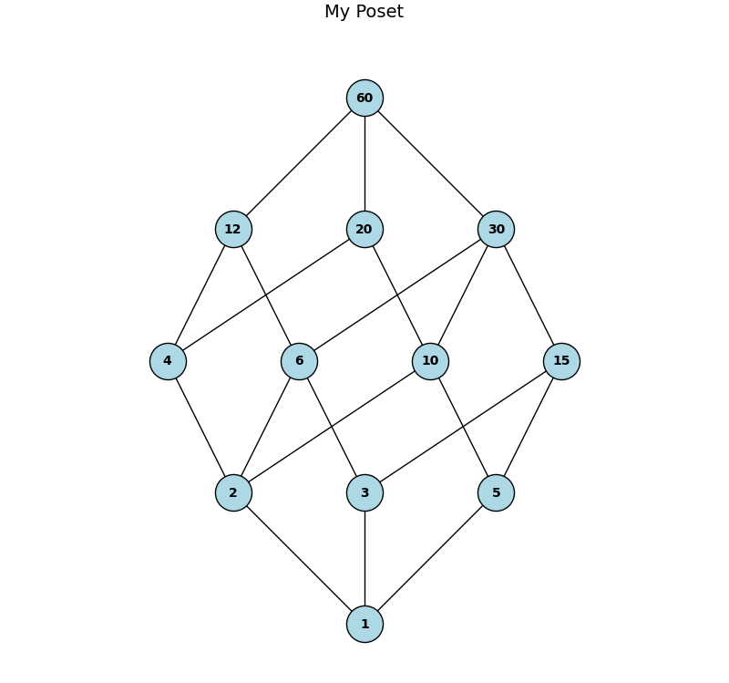

# 🔷 Hasse Diagram Visualizer


A Python tool to visualize the **Hasse diagram** of a partially ordered set (poset). This tool performs a transitive reduction, checks for structural validity, and draws a clean, level-based diagram using `networkx` and `matplotlib`.

---

## 📚 What Is a Hasse Diagram?

A **Hasse diagram** is a simplified drawing of a partially ordered set (poset), where:

- Only the **essential order relations** are shown (i.e., transitive and reflexive relations are omitted).
- Edges are drawn **upward** to represent the partial order.
- The diagram is **layered**, showing elements by level of dependency.

---

## 📂 Project structure

```bash
hasse-diagram/
│
├── hasse.py            # Main module with all functionality
├── example.py          # Example script to test the library
├── README.md           # Documentation
├── images/
│   └── example_diagram.png  # Output example
```

---

## ✨ Features

✅ Automatically performs **transitive reduction** to eliminate redundant relations  
✅ Validates that the input is a **true poset** 
✅ Dynamically adjusts **node size** and **layout** based on input size  
✅ Supports **custom node colors** (classic colors like `red`, `green`, `blue`, etc.)  
✅ Clean, level-based layout using `matplotlib` and `networkx`

---

## 📦 Installation

Make sure you have Python 3.7+ installed. Then install the required packages:

```bash
pip install matplotlib networkx
```

---

## 🛠️ Usage

Import the package

```bash
from hasse import display_hasse_diagram
```

Define your poset (reflexive pairs are optional)

```bash
poset = [(1, 2), (2, 3), (1, 3), (3, 4), (4, 4)]
```

Set a title and node color, then display the diagram

```bash
display_hasse_diagram(poset, title="My First Poset", node_color="skyblue")
```

Example diagram



---


## 📄 License

This project is licensed under the **MIT License**.  
You are free to use, modify, and distribute this software with proper attribution.

---

## 🤝 Contributions

Contributions are welcome!

If you have ideas for improvement, bug reports, or would like to add new features:

1. Fork this repository
2. Create your feature branch (`git checkout -b feature/my-feature`)
3. Commit your changes (`git commit -am 'Add new feature'`)
4. Push to the branch (`git push origin feature/my-feature`)
5. Open a Pull Request

Please ensure your code is clean, documented, and tested. Thank you!
